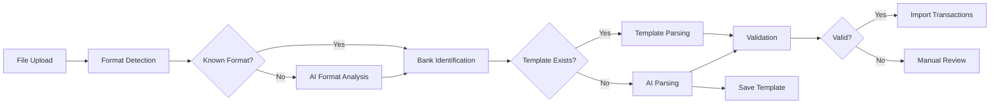

# Universal Bank Statement Import with AI Intelligence

## Overview
This document outlines the implementation plan for supporting transaction imports from any bank globally using AI intelligence while optimizing costs. The system will support CSV files, PDF statements, and screenshot/image uploads.

## Current State Analysis
The existing implementation has:
- Basic file import structure (`ImportedFile` model)
- Simple CSV parsing placeholder
- File storage using Azure Blob Storage
- Import processing worker service
- No actual PDF or image support
- No AI integration for parsing

## Implementation Plan

### 1. Processing Architecture: Synchronous vs Asynchronous

The implementation requires a **hybrid approach** combining synchronous APIs for quick operations and asynchronous workers for heavy processing to optimize user experience.

#### Synchronous Processing (Direct Response)
**Best for:**
- File upload & validation (<100KB files)
- Format detection (milliseconds)
- Template lookup (database query)
- Known bank CSV parsing (<1000 rows)
- Cost estimation
- Preview generation (first 10 rows)

#### Asynchronous Processing (Background Workers)
**Required for:**
- PDF processing with OCR (5-30 seconds)
- Image/screenshot OCR (10-60 seconds)
- Large CSV files (>1000 rows)
- AI analysis with GPT-4 (3-15 seconds)
- Batch imports (multiple files)
- Files requiring multiple AI calls

#### Processing Time Estimates
| Operation | Time | Approach |
|-----------|------|----------|
| CSV parsing (known bank) | 100-500ms | Synchronous |
| CSV parsing (unknown bank) | 3-5s | Asynchronous |
| PDF text extraction | 1-3s | Asynchronous |
| PDF with OCR | 10-30s | Asynchronous |
| Image OCR | 5-20s | Asynchronous |
| GPT-4 analysis | 3-15s | Asynchronous |
| Template matching | 10-50ms | Synchronous |

#### Smart Import Router Implementation
```csharp
// Smart router that decides sync vs async
[HttpPost("api/import/smart")]
public async Task<IActionResult> SmartImport(IFormFile file)
{
    var analyzer = new ImportAnalyzer();
    var decision = await analyzer.Analyze(file);
    
    if (decision.UseSyncProcessing)
    {
        try
        {
            var result = await ProcessSynchronously(file);
            return Ok(result);
        }
        catch (TimeoutException)
        {
            // Fallback to async if sync takes too long
            decision.UseSyncProcessing = false;
        }
    }
    
    if (!decision.UseSyncProcessing)
    {
        var jobId = await EnqueueForProcessing(file);
        return Accepted(new 
        { 
            jobId,
            reason = decision.AsyncReason,
            estimatedTime = decision.EstimatedSeconds
        });
    }
}

// Synchronous processing criteria
private bool CanProcessSynchronously(FileAnalysis analysis)
{
    return analysis.FileSize < 100_000 // 100KB
        && analysis.Format == "CSV"
        && analysis.HasKnownTemplate
        && analysis.RowCount < 500;
}
```

#### Frontend User Experience
```javascript
// Frontend handling for optimal UX
async function importFile(file) {
    // Try quick import first
    const response = await fetch('/api/import/smart', {
        method: 'POST',
        body: formData
    });
    
    if (response.status === 200) {
        // Immediate result
        showSuccess("Import completed!");
    } else if (response.status === 202) {
        // Queued for processing
        const { jobId, estimatedTime } = await response.json();
        showProgress(`Processing... (Est. ${estimatedTime}s)`);
        pollForStatus(jobId);
    }
}

function pollForStatus(jobId) {
    const interval = setInterval(async () => {
        const status = await checkStatus(jobId);
        updateProgressBar(status.progress);
        
        if (status.completed) {
            clearInterval(interval);
            showResults(status.results);
        }
    }, 2000); // Poll every 2 seconds
}
```

### 2. Enhanced Data Models

#### Extended ImportedFile Model
```csharp
public class ImportedFile
{
    // Existing fields...
    public string? DetectedBankName { get; set; }
    public string? DetectedCountry { get; set; }
    public string? DetectedFormat { get; set; } // CSV, PDF, IMAGE
    public string? TemplateVersion { get; set; }
    public string? ParsingMetadata { get; set; } // JSON field
    public decimal? AICost { get; set; } // Track AI usage cost
}
```

#### New BankTemplate Entity
```csharp
public class BankTemplate
{
    public Guid Id { get; set; }
    public string BankName { get; set; }
    public string Country { get; set; }
    public string FileFormat { get; set; }
    public string TemplatePattern { get; set; } // JSON structure
    public int SuccessCount { get; set; }
    public int FailureCount { get; set; }
    public DateTime LastUsed { get; set; }
    public DateTime CreatedAt { get; set; }
    public DateTime UpdatedAt { get; set; }
}
```

#### ImportParsingCache Entity
```csharp
public class ImportParsingCache
{
    public Guid Id { get; set; }
    public string FileHash { get; set; }
    public string BankName { get; set; }
    public string ParsedStructure { get; set; } // JSON
    public DateTime ExpiresAt { get; set; }
}
```

### 2. Multi-Format Parser Service Architecture

```
┌─────────────────────────────────────────────────────────┐
│                  UniversalBankParser                     │
├─────────────────────────────────────────────────────────┤
│  - DetectFormat(byte[] data): FileFormat                │
│  - ParseFile(byte[] data, FileFormat): ParsedData       │
│  - ValidateData(ParsedData): ValidationResult           │
└─────────────────────────────────────────────────────────┘
                              │
                              ├── CSVParser
                              ├── PDFParser
                              └── ImageParser
```

### 3. AI-Powered Bank Detection & Parsing

#### AIBankAnalyzer Service
```csharp
public interface IAIBankAnalyzer
{
    Task<BankDetectionResult> DetectBankAsync(byte[] fileData, string fileType);
    Task<TransactionParsingResult> ParseTransactionsAsync(
        byte[] fileData, 
        BankDetectionResult bankInfo);
    Task<decimal> EstimateAICostAsync(int fileSize, string fileType);
}
```

#### AI Processing Flow
1. **Initial Analysis** (GPT-4 Vision for images, GPT-4 for text):
   - Extract bank name, country, statement period
   - Identify transaction table boundaries
   - Map columns to standard fields (date, description, amount, balance)
   
2. **Template Learning**:
   - Store successful parsing patterns
   - Update confidence scores
   - Version control for templates

3. **Cost Optimization Strategy**:
   ```
   Tier 1: Known template match (No AI cost)
   Tier 2: Fuzzy pattern matching ($0.001)
   Tier 3: GPT-3.5 Turbo parsing (~$0.01)
   Tier 4: GPT-4 Vision parsing (~$0.10)
   ```

### 4. Smart Transaction Extraction Pipeline



### 5. Image/Screenshot Support

#### OCR Processing Pipeline
```csharp
public class OCRService
{
    // Image preprocessing
    - DeskewImage(Image image)
    - EnhanceContrast(Image image)
    - RemoveNoise(Image image)
    
    // OCR extraction
    - ExtractText(Image image): string
    - ExtractWithRegions(Image image): TextRegion[]
    
    // Post-processing
    - CleanupText(string text): string
    - ExtractTables(TextRegion[] regions): Table[]
}
```

#### Supported Image Formats
- PNG, JPG, JPEG
- PDF with embedded images
- Screenshots from mobile banking apps
- Scanned documents

### 6. Cost Optimization Implementation

#### Template Matching Algorithm
```csharp
public class TemplateMatchingService
{
    public async Task<TemplateMatch?> FindBestMatch(
        string bankName, 
        string country, 
        string format)
    {
        // 1. Exact match
        // 2. Fuzzy match (Levenshtein distance)
        // 3. Regional patterns
        // 4. Global patterns
    }
}
```

#### Cost Tracking
- Track AI API calls per import
- Calculate cost per transaction extracted
- Monthly cost reports per user
- Optimization recommendations

### 7. Implementation Components

#### New Services to Create
| Service | Purpose | Location |
|---------|---------|----------|
| UniversalBankParser | Main parsing orchestrator | `/api/Services/Parsing/` |
| AIBankAnalyzer | OpenAI integration | `/api/Services/AI/` |
| OCRService | Image text extraction | `/api/Services/OCR/` |
| BankTemplateService | Template management | `/api/Services/Templates/` |
| FormatDetectionService | File type detection | `/api/Services/Parsing/` |
| CostTrackingService | AI usage monitoring | `/api/Services/Monitoring/` |

#### Files to Modify
| File | Changes |
|------|---------|
| ImportService.cs | Integrate new parsing pipeline |
| ImportProcessorWorker.cs | Use UniversalBankParser |
| ImportController.cs | Add image upload endpoint |
| ImportedFile.cs | Add new fields |
| BudgetTrackerDbContext.cs | Add new entities |

### 8. Required NuGet Packages

```xml
<!-- PDF Processing -->
<PackageReference Include="iTextSharp" Version="5.5.13" />
<PackageReference Include="PdfSharp" Version="1.50.5" />

<!-- OCR -->
<PackageReference Include="Tesseract" Version="5.2.0" />
<PackageReference Include="Tesseract.Data.English" Version="4.0.0" />

<!-- Image Processing -->
<PackageReference Include="SixLabors.ImageSharp" Version="3.0.2" />

<!-- CSV Processing -->
<PackageReference Include="CsvHelper" Version="30.0.1" />

<!-- AI Integration -->
<PackageReference Include="OpenAI" Version="1.7.2" />

<!-- Pattern Matching -->
<PackageReference Include="FuzzySharp" Version="2.0.2" />
```

### 9. API Endpoints

#### New Endpoints
```csharp
[HttpPost("api/import/analyze")]
public async Task<BankAnalysisResult> AnalyzeFile(IFormFile file)
// Returns: Bank detection, format analysis, cost estimate

[HttpPost("api/import/upload-image")]
public async Task<ImportResult> UploadImage(IFormFile image)
// Handles: PNG, JPG, screenshot uploads

[HttpGet("api/import/templates")]
public async Task<IEnumerable<BankTemplate>> GetKnownBanks()
// Returns: List of supported banks with confidence scores

[HttpPost("api/import/validate")]
public async Task<ValidationResult> ValidateExtraction(ExtractedData data)
// Validates: Extracted transactions before import

[HttpGet("api/import/cost-estimate")]
public async Task<CostEstimate> EstimateCost(FileMetadata metadata)
// Returns: Estimated AI processing cost
```

### 10. Database Migrations

```sql
-- Add new fields to ImportedFiles
ALTER TABLE ImportedFiles ADD COLUMN DetectedBankName VARCHAR(255);
ALTER TABLE ImportedFiles ADD COLUMN DetectedCountry VARCHAR(100);
ALTER TABLE ImportedFiles ADD COLUMN DetectedFormat VARCHAR(50);
ALTER TABLE ImportedFiles ADD COLUMN TemplateVersion VARCHAR(50);
ALTER TABLE ImportedFiles ADD COLUMN ParsingMetadata JSONB;
ALTER TABLE ImportedFiles ADD COLUMN AICost DECIMAL(10,4);

-- Create BankTemplates table
CREATE TABLE BankTemplates (
    Id UUID PRIMARY KEY,
    BankName VARCHAR(255) NOT NULL,
    Country VARCHAR(100),
    FileFormat VARCHAR(50),
    TemplatePattern JSONB,
    SuccessCount INT DEFAULT 0,
    FailureCount INT DEFAULT 0,
    LastUsed TIMESTAMP,
    CreatedAt TIMESTAMP DEFAULT NOW(),
    UpdatedAt TIMESTAMP DEFAULT NOW()
);

-- Create ImportParsingCache table
CREATE TABLE ImportParsingCache (
    Id UUID PRIMARY KEY,
    FileHash VARCHAR(64) NOT NULL,
    BankName VARCHAR(255),
    ParsedStructure JSONB,
    ExpiresAt TIMESTAMP,
    CreatedAt TIMESTAMP DEFAULT NOW()
);

-- Indexes for performance
CREATE INDEX idx_bank_templates_lookup 
ON BankTemplates(BankName, Country, FileFormat);

CREATE INDEX idx_parsing_cache_hash 
ON ImportParsingCache(FileHash);
```

### 11. Configuration

#### appsettings.json
```json
{
  "AIServices": {
    "OpenAI": {
      "ApiKey": "${OPENAI_API_KEY}",
      "Model": "gpt-4-vision-preview",
      "MaxTokens": 4000,
      "Temperature": 0.3
    },
    "CostLimits": {
      "MaxCostPerImport": 0.50,
      "MaxMonthlyPerUser": 10.00
    }
  },
  "OCR": {
    "TesseractDataPath": "./tessdata",
    "Languages": ["eng", "spa", "fra", "deu"],
    "Confidence": 0.8
  },
  "ImportLimits": {
    "MaxFileSizeMB": 10,
    "MaxTransactionsPerImport": 10000,
    "SupportedFormats": [".csv", ".pdf", ".png", ".jpg", ".jpeg"]
  }
}
```

### 12. Error Handling & Validation

#### Common Error Scenarios
1. **Unsupported Bank Format**
   - Fallback to manual column mapping
   - Request user assistance for mapping

2. **OCR Quality Issues**
   - Provide confidence scores
   - Highlight uncertain extractions
   - Allow manual corrections

3. **AI Rate Limits**
   - Queue processing
   - Implement exponential backoff
   - Notify users of delays

4. **Cost Overruns**
   - Switch to lower-tier processing
   - Batch similar imports
   - Provide cost warnings

### 13. Testing Strategy

#### Unit Tests
- Format detection accuracy
- Template matching logic
- Cost calculation
- Validation rules

#### Integration Tests
- End-to-end import flow
- AI service mocking
- OCR accuracy benchmarks
- Performance under load

#### Test Data
- Sample statements from 50+ banks
- Multiple languages
- Various PDF formats
- Screenshot samples

### 14. Monitoring & Analytics

#### Key Metrics
- **Success Rates**: By bank, country, format
- **AI Costs**: Per import, per user, per month
- **Processing Time**: Average, P95, P99
- **Template Hit Rate**: Cache effectiveness
- **Error Rates**: By error type

#### Dashboards
- Real-time import status
- Cost tracking dashboard
- Bank coverage map
- User feedback analytics

### 15. Future Enhancements

#### Phase 2 Features
- Multi-language support (non-English statements)
- Automatic categorization learning
- Duplicate detection across accounts
- Smart reconciliation suggestions

#### Phase 3 Features
- Mobile app with camera capture
- Real-time bank API integrations
- Predictive transaction matching
- Automated expense reports

## Implementation Timeline

### Week 1-2: Core Infrastructure
- Database schema updates
- Basic service structure
- File format detection

### Week 3-4: AI Integration
- OpenAI service setup
- Template learning system
- Cost tracking

### Week 5-6: Parser Implementation
- CSV enhanced parser
- PDF extraction
- Image OCR pipeline

### Week 7-8: Testing & Optimization
- Integration testing
- Performance tuning
- Cost optimization

### Week 9-10: UI & Documentation
- Upload interfaces
- Progress tracking
- User documentation

## Success Criteria

1. **Coverage**: Support 95% of major banks globally
2. **Accuracy**: 99% transaction extraction accuracy
3. **Cost**: < $0.10 average cost per import
4. **Performance**: < 30 seconds processing time
5. **User Satisfaction**: 4.5+ star rating

## Risk Mitigation

| Risk | Impact | Mitigation |
|------|--------|------------|
| AI API failures | High | Fallback to template matching |
| High processing costs | Medium | Implement strict cost limits |
| Poor OCR quality | Medium | Manual review queue |
| Bank format changes | Low | Version-controlled templates |
| Data privacy concerns | High | Local processing option |

## Conclusion

This implementation will provide a robust, cost-effective solution for importing bank statements from any bank globally, leveraging AI intelligence while maintaining operational efficiency through smart caching and tiered processing strategies.